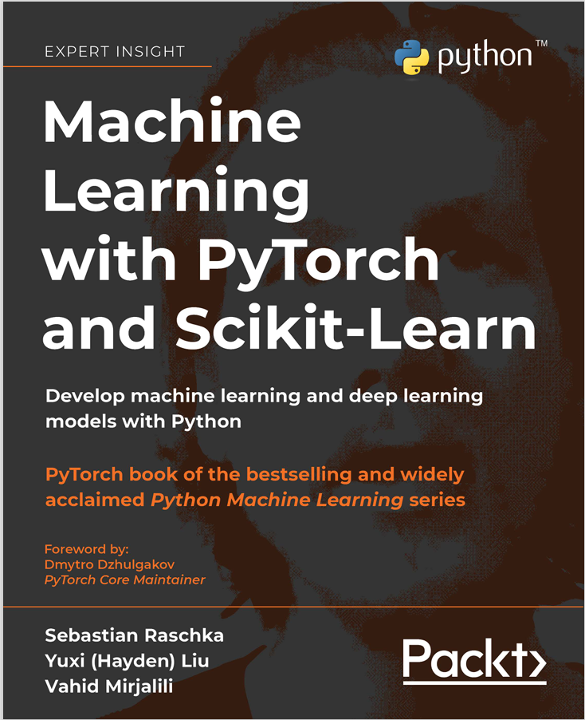

# MLwPTaSL
Machine Learning with PyTorch and Scikit-Learn

---

# Table of Content

- Preface  (xxiii)

| [ < ](https://github.com/engineer-e) | T |  N |
|---|--- |--- |
| 1 | [Giving Computers the Ability to Learn from Data](#chapter-1-giving-computers-the-ability-to-learn-from-data)|  1 | 
| 2 | Training Simple Machine Learning Algorithm for Classification |  19 |
| 3 | A Tour of Machine Learning Classifiers Using Scikit-Learn |  53 |
| 4 | Building Good Training Datasets - Data Preprocessing   | 105 |
| 5 | Compressing Data via Dimensionality Reduction | 139 |
| 6 | Learning Best Practices for Model Evaluation and Hyperparameter Tuning  |171 |
| 7 | Combining Different Models for Ensemble Learning  | 205 |
| 8 | Applying Machine Learning to Sentiment Analysis  | 247 |
| 9 | Predicting Continuous Target Variables with Regression Analysis  | 269 |
| 10 | Working with Unlabeled Data - Clustering Analysis  | 305 |
| 11 | Implementing a Multilayer Artifical Neural Network from Scratch | 335 |
| 12 | Parallelizing Neural Network Training with PyTorch  | 369 |
| 13 | Going Deeper - The Mechanics of PyTorch  | 409 |
| 14 | Classifying Images with Deep Convolutional Neural Networks  | 451 |
| 15 | Modeling Sequential Data Using Recurrent Neural Networks  | 499 |
| 16 | Transformers - Improving Natural Language Processing with Attention Mechanisms  | 539 |
| 17 | Generative Adversarial Networks for Synthesizing New Data  | 589 |
| 18 | Graph Neural Networks for Capturing Dependencies in Graph Structured Data  | 637 |
| 19 | Reinforcement Learning for Decision Making in Complex Environment  | 673 |

- Other Books You May Enjoy (719)
- Index (723)

---

# Chapter 1: Giving Computers the Ability to Learn from Data

| [ < ](#table-of-content) | T | N |
|---|--- |--- |
| 1 | Building intelligent machines to transform data into knowledge  | 1 | 
| 2 | [The three different types of machine learning](#the-three-different-types-of-machine-learning) | 2 |
| 3 | Introduction to the basic terminology and notations  | 9 |
| 4 | A roadmap for building machine learning systems | 12 |
| 5 | Using Python for maching learning  | 14 |
| 6 | Summary  | 17|

## The three different types of machine learning

| [ < ](#chapter-1-giving-computers-the-ability-to-learn-from-data) | T | N |
|---|--- |--- |
| 1 | [Making predictions about the future with supervised learning](#making-predictions-about-the-future-with-supervised-learning)  | 3|
| 2 | Solving interactive problems with reinforcement learning | 6 |
| 3 | [Discovering hidden structures with unsupervised learning](#discovering-hidden-structures-with-unsupervised-learning) | 7|

### Making predictions about the future with supervised learning

| [ < ](#the-three-different-types-of-machine-learning) | T | N |
|---|--- |--- |
| 1 | Classification for predicting class lebels | 4 |
| 2 | Regression for predicting continuous outcomes | 5 |

### Discovering hidden structures with unsupervised learning

| [ < ](#the-three-different-types-of-machine-learning) | T | N |
|---|--- |--- |
| 1 | Finding subgroups with clustering  | 8 |
|2 | Dimensionality reduction for data compression | 8|